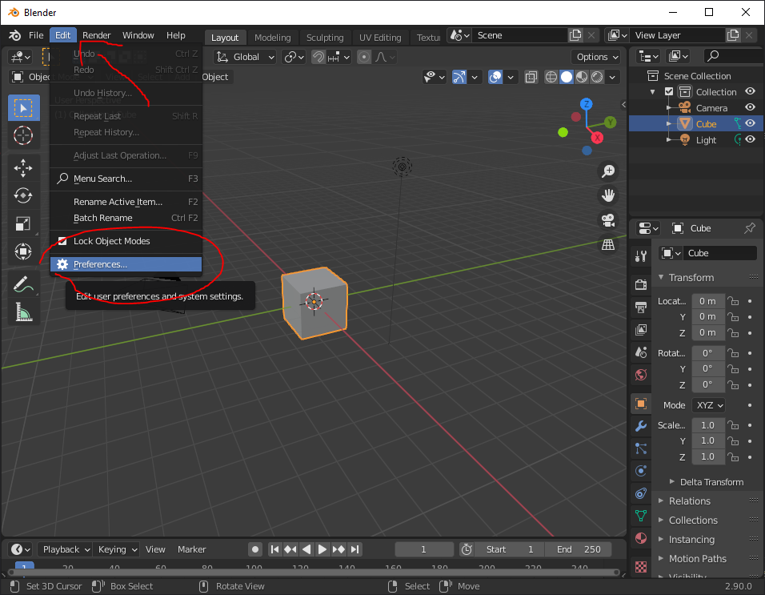
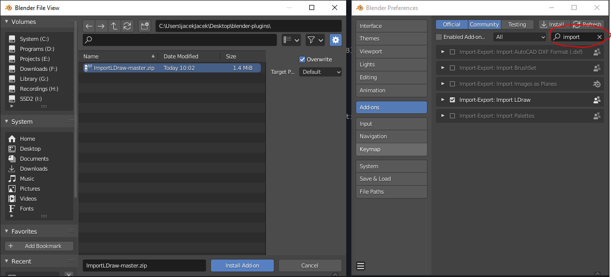
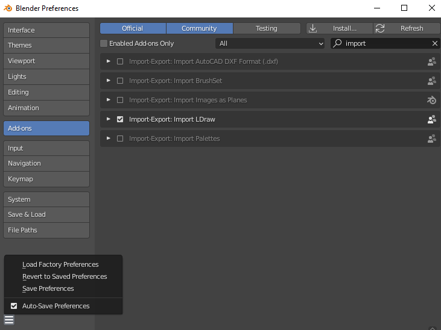
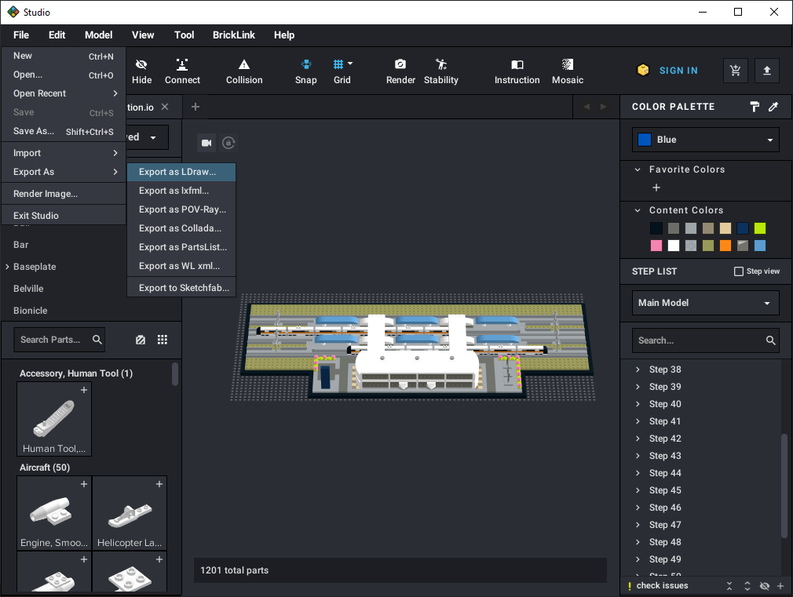
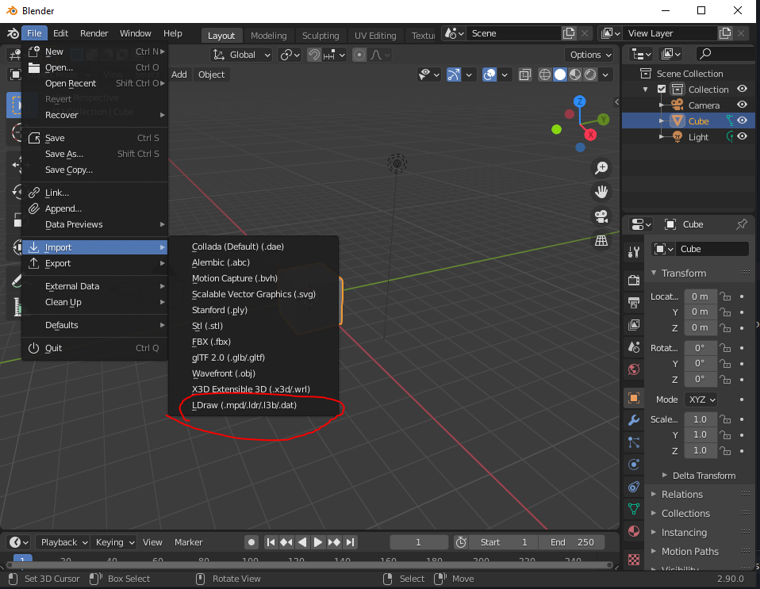
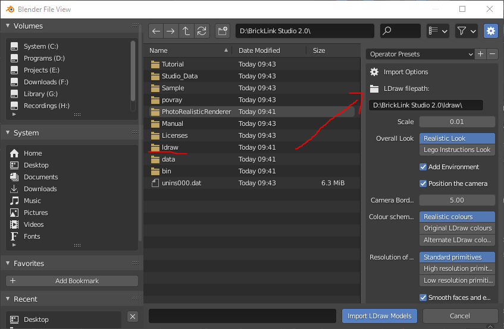
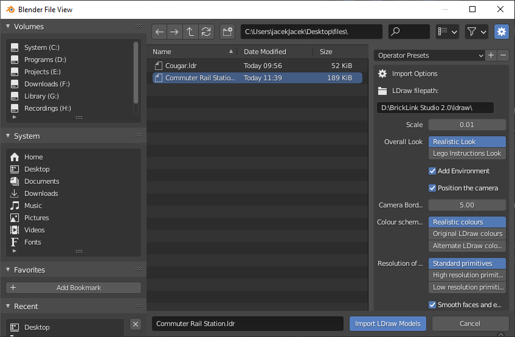

# Importowanie z BrickLink Studio do Blendera 2.81+
## Wymagane
1. [Blender](https://www.blender.org/download/releases/)
2. [BrickLink Studio](https://www.bricklink.com/v3/studio/download.page)
3. [TobyLobster's ImportLDraw](https://github.com/TobyLobster/ImportLDraw)

## Co chcemy zrobić
Zaimportować model z BrickLink Studio do Blender

## Instalacja
1. Zainstaluj Blender oraz BrickLink Studio z dostarczonych linków. Zapisz adres BrickLink Studio, będzie potrzebny potem.
2. Pobierz archiwum ImportLDraw z strony githuba.
3. Otwórz Blender. Wybierz Edit > Preferences. 
    
4. Znajdź plik archiwum przy użyciu menedżera folderów Blender.
5. Zainstaluj addon i potem zatwierdź go w ustawieniach. Użyj opcji wyszukaj by przyśpieszyć proces ("Import LDraw").
    
6. Zapisz ustawienia, jeśli chcesz żeby addon był domyślnie w programie. 
    

## Pipeline
1. Stwórz lub otwórz model w Bricklink Studio, który chcesz zaimportować do Blender.
2. Wybierz 'Export as Ldraw'.
    
3. Otwórz Blender. Select Import > LDraw
    
4. Wtaw adres folderu BrickLink Studio/LDraw do *LDraw Filepath* - w ten sposób możesz być pewien że BrickLink Studio oraz importer używają tego samego zestawu pliku do generowania modeli.
    
5. Wybierz plik do importu i ustaw to co Ci pasuje.
    
6. Może to chwile zająć, więc bądź cierpliwy.
7. Teraz możesz to wyrenderować lub zmodyfikować przy użyciu narzędzi Blender.

## Prawne
Wszystkie prawa należą do ich prawowitych właścicieli, włączając: LEGO, Blender Fundation, TobyLobster oraz Estate of James Jessiman. Ten poradnik nie jest rozwijany lub wspierany przez wcześniej wymienionych.
