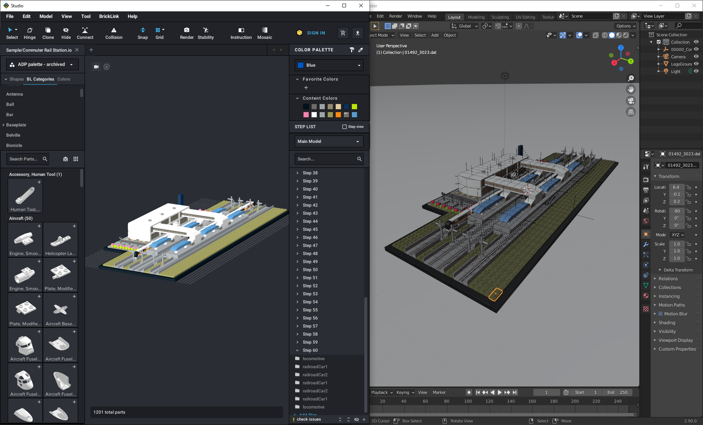

# Importing from BrickLink Studio into Blender 2.81+
## Prerequisites
1. [Blender](https://www.blender.org/download/releases/)
2. [BrickLink Studio](https://www.bricklink.com/v3/studio/download.page)
3. [TobyLobster's ImportLDraw](https://github.com/TobyLobster/ImportLDraw)

## What we are going to do
Import model file from BrickLink Studio to Blender

## Instalation
1. Install Blender and BrickLink Studio using provided links. Keep directory of BrickLink Studio, it will be needed later.
2. Download ZIP file of ImportLDraw from github page.
3. Open Blender. Select Edit > Preferences. 
    
4. Find ZIP file using Blender directory manager.
5. Install addon and then apply it in preferences. Use find option to make it quicker ("Import LDraw").
    
6. Save preferences if you wish to have it as default.
    

## Pipeline
1. Create or open model in BrickLink Studio that you wish to import to Blender.
2. Select 'Export as Ldraw'.
    
3. Open Blender. Select Import > LDraw
    
4. Supply directory path of BrickLink Studio/LDraw folder to *LDraw Filepath* - that way, you can be sure that BrickLink Studio and importer are using same files to render creations.
    
5. Select file to import and change import options as you wish.
    
6. It may take a while, so be patient.
7. Now you may render it or modify it via Blender tools.

## Legal
All rights belongs to respective owners, including: LEGO, Blender Fundation, TobyLobster and Estate of James Jessiman. This manual is not developed or endorsed by any of those mentioned before.
